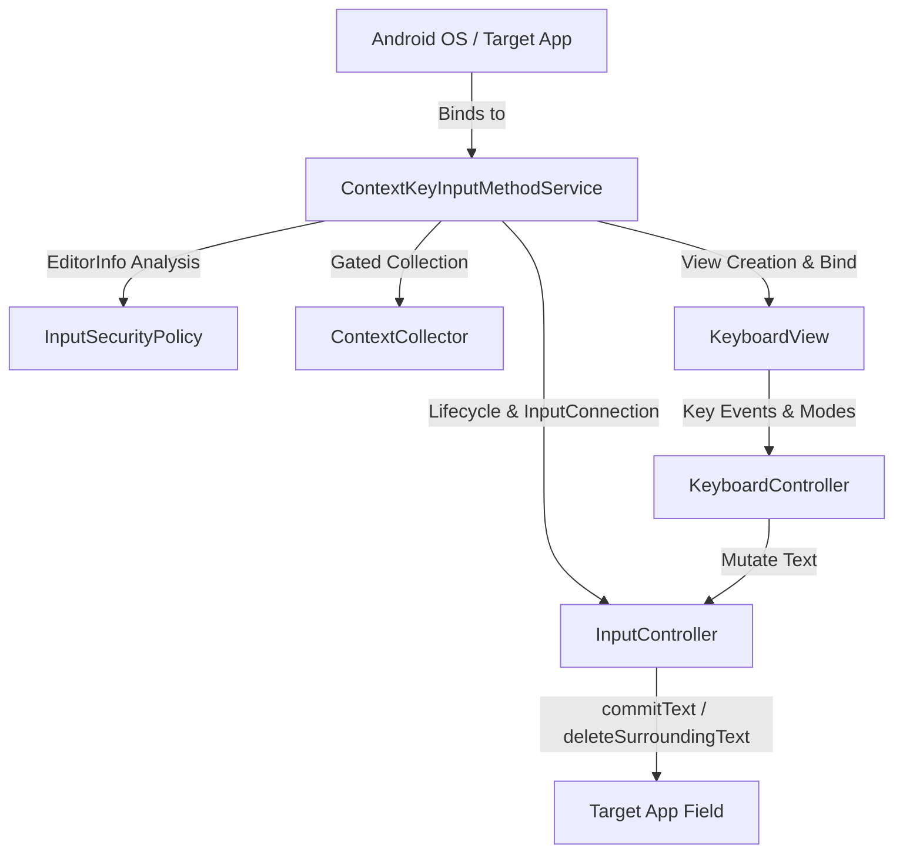

# ContextKey Architecture

## High-Level Architecture (Phase 1)



## Module Structure

ContextKey AI repository contains modular decoupled sub-projects:

- `android_keyboard/`: Native Android Input Method (IME) application (`com.contextkey.ai.keyboard`).
- `flutter_app/`: Companion management and dashboard application (Phase 2+).
- `backend/`: Future cloud sync / hybrid backend (Phase 3+).
- `docs/`: Technical specifications, architectural decisions, and security documentation.

## Package Architecture (`android_keyboard`)

```
com.contextkey.ai.keyboard
│
├── ime/
│   └── ContextKeyInputMethodService   # Native InputMethodService lifecycle entry point
│
├── ui/
│   ├── KeyboardView                   # Container rendering header and active row keys
│   ├── KeyboardHeaderView             # Accessory bar with brand label and placeholder AI pill
│   ├── KeyView                        # Individual key view with haptic feedback and selectors
│   └── KeyboardController             # Handles shift states, keyboard modes, IME switching
│
├── input/
│   ├── InputController                # Direct InputConnection manipulator (insert, delete, enter)
│   └── ContextCollector               # Boundary abstraction for safe context collection
│
├── security/
│   └── InputSecurityPolicy            # Password and sensitive input detection
│
└── model/
    └── KeyboardLayout                 # Data definitions for QWERTY, Numeric & More Symbol layouts
```

## Lifecycle & Data Flow

1. **Service Registration**:
   `ContextKeyInputMethodService` registers with `android.permission.BIND_INPUT_METHOD` and `@xml/method` subtype in `AndroidManifest.xml`.

2. **Session Start**:
   When the user focuses an editable field in any app (Chrome, WhatsApp, Notes), Android triggers `onStartInput()` and `onStartInputView()`, providing the active `EditorInfo`.

3. **Security Assessment**:
   `InputSecurityPolicy` inspects `EditorInfo.inputType` and `EditorInfo.imeOptions`. If sensitive (e.g. password, PIN, no-learning), all context collection is strictly vetoed.

4. **User Typing**:
   Key taps on `KeyView` trigger `KeyboardController.handleKeyClick()`, which dispatches text insertion, deletion, or editor actions directly through `InputController` using Android's `InputConnection`.
